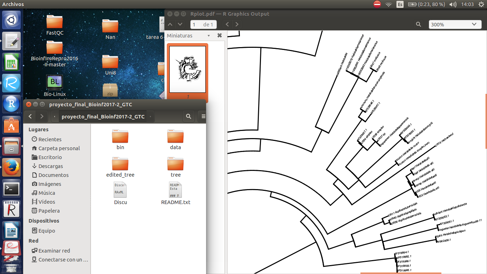

# Avance 3

###  Alineamiento 

* Logré correr el alineamiento en la terminal con dos sofware: mafft y muscle

### Hipótesis filogenética

* Logré correr el análisis de Verosimilitud Máxima en la terminal con el sofware RaxML 

* Me encató que este estuviera muy bien docomentado, sólo leer su manual me  facilitó mucho correr el análisis

### Avance en general y próximo y último paso

* Ya tengo listo el script que abarca los pasos anteriores y funciona bien!!
* El siguiente paso es terminar de editar el script en R para editar los árboles producidos. Sin embargo, he tenido problemas al instalar "ggtree" y al parecer sólo es éste, porque he podido instalar otras paqueterias de CRAN sin problemas. El resto de la semana seguiré intentando, de no poder, lo editaré solo con "phytools" en este ya pude abrirlo y plotearlo sin problemas 

 

;)